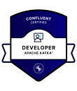
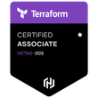
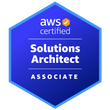

# Artem Kustikov - Detailed Experience

Vienna ¤ Austria

[Back to main](README.md) ¤ [📧 artem.kustikov@gmail.com](mailto:artem.kustikov@gmail.com) ¤ [+43 664 9310 6218](tel:+4366493106218) 

## Skills 

* *JavaScript (Web, Full Stack)*: from 2002 and IE 5 till now
* *DevOps*: Docker, Terraform, Kubernetes, AWS, Azure, GCP, Gitlab - from 2015 till now
* *Python*: Django, Flask, SQLAlchemy, NumPy, nltk, scikit-learn, Pandas, Robot framework, FastAPI - from 2008 till now
* *.NET*: from 2002 with ASP.NET Forms and Microsoft SharePoint to `MCSA: Web Applications` in 2016
* *C++*: from 2001 and Visual Studio 6/MFC till C++20 in 2018
* *Java*: from Java 1.3 (2004) and Struts till Spring Boot/Quarkus now
* Performed 500+ technical interviews in JavaScript, DevOps, .NET, and Golang

### Platforms/Technologies

* JavaScript/TypeScript, ECMA-262/ES6/ES2015-20XX, AJAX, websockets, XML/XSLT, JSON/JSONP, Promise, co, jQuery, jQuery UI, Ext.js 4/5, Twitter Bootstrap 2/3, Backbone.js, Meteor.js, AngularJS, Angular, React/redux, knockoutjs, Node.js, express, koa, passport, cluster, AFrame, grunt, THREE.js, gulp, bower, webpack, yarn, phantomjs, karma, lerna, jest, Cypress
* Docker, Helm, Kubernetes, Terraform, Kustomize
* Python, Django, Flask, SQLAlchemy, NumPy, nltk, scikit-learn, robot framework
* C++/C++14/17 (Windows/Linux), MFC/COM/ATL, OpenGL, STL, sockets, boost, pthreads, MySQL C++ API, Internet Explorer extensions, ActiveMQ
* Go, GRPC, protobuf, excelize
* Java 1.3/21, applets, servlets, Struts/FOP/JSTL/POI, JBoss, Tomcat, Spring Framework, Spring Boot, Quarkus, Gradle
* ASP 3.0, VBScript, JScript, powershell scripting
* .NET, C# 1.0/7.0, Managed C++, ASP.NET Web Forms, ASP.NET MVC (1.0-5.0), MVC WebAPI, WCF/WCF.Extras, SignalR, OWIN, Nancy, WPF/WinForms, Unity, Entity Framework
* MS Access, MS SQL, MySQL, PostgreSQL, Oracle, MongoDB, Redis, DynamoDB, ElasticSearch
* Apache Kafka, Flink, Redpanda, Confluent
* Medicine: ECG, DICOM, EDF, HL7, ISHNE
* Document Storage: MS Sharepoint, MOSS/WSS, Aconex, Primavera, Documentum, EnterpriseVault, MS Exchange, Dropbox, box.com, ApparelMagic, RLM, SAP
* IIS5/8, Apache, nginx
* PHP 3/5, OpenCommerce, Zend, Joomla
* CSS 1/2/3, SASS, LESS, PostCSS
* Cordova, PhoneGap, Safari Extensions
* AWS: EC2, ElasticBeanstalk, RDS, Route 53, CloudFront, SQS, CloudFormation, S3, ECS
* Google Cloud: BigTable, PubSub, StackDriver
* Azure: Virtual machines, SQL Databases, Monitor, Kubernetes

## Experience

### Aug 2022 - Current

[Machine Learning Reply](https://www.reply.com/machine-learning-reply/de/)

_Software company in Vienna, Austria_

Position: Principal Consultant, AI/DevOps/FullStack Software Developer

#### Technologies 

* Nodejs, Typescript, React, Next.js, ReactFlow, Tailwind CSS
* Python, PydanticAI, Azure Functions, Azure OpenAI, Azure AI Foundry, AWS Bedrock, Langfuse, MCP
* Java, Spring Boot, Quarkus, Gradle, Flyway
* PostgreSQL, MS SQL Server
* Apache Kafka, Flink, Redpanda, Confluent
* Azure: Kubernetes services, Container Apps, Functions, Cosmos DB, Storage Queues, Service Bus, Key Vault, Logic Apps, Entra ID, Monitor, SQL Databases, Cache for Redis, API Management
* AWS: CloudFormation, RDS, EC2, S3, EKS, CodeBuild/CodePipeline/CodeDeploy
* Terraform, Helm, Kubernetes, Docker

#### Projects

🧩 *Self-service agentic AI platform – Solution Architect/AI Engineer*

A self-service agentic platform that lets a non-engineer describe an AI agent in chat, get it back as an editable visual workflow on a canvas, publish it, and have real inbound traffic run it. Agents are triggered by four channels — a shared mailbox, embeddable web forms, live phone calls and cron schedules — and can ground their answers in uploaded knowledge bases, classify requests and draft replies in the customer's language, call platform tools such as Salesforce case creation and SAP hand-off, and reach customer systems through authenticated MCP servers. Ships in two shapes from one codebase: a multi-tenant service where one portal serves several customer organisations with their own branding, users and data, and a single-tenant install deployed inside a customer's own Azure subscription. Owned the platform end to end — the Next.js portal and its server-side API, the two Python queue-driven backend services, the realtime voice channel, the multi-tenant data model and the Terraform that stands the whole thing up from an empty subscription.

Stack: TypeScript, Next.js (App Router), React, ReactFlow, Tailwind CSS, Redux, MSAL, SSE, WebRTC, Vitest • Python 3.12, Azure Functions v2, PydanticAI, Pydantic, asyncio, pytest • Azure OpenAI (Responses API, realtime models), Azure AI Foundry (vector stores, file_search, web_search), Whisper, MCP • Azure Container Apps, Functions, Cosmos DB, Storage Queues/Blob, Cache for Redis, Key Vault, Container Registry, Logic Apps, Entra ID/OAuth2, Managed Identity, Application Insights • Terraform, GitHub Actions (OIDC), Docker, Turborepo, AWS Route 53

* Designed and built the full-stack architecture — a Next.js portal holding all server-side platform logic, two Python Azure Function Apps (dispatcher and executor) and four Storage Queues as the only seams between them, so any stage can be run, replaced or debugged in isolation.
* Built the visual workflow builder on ReactFlow with an autosaving canvas, a streaming assistant that generates workflow JSON from a chat description, and per-node inspectors; defined the workflow JSON contract shared by the canvas, the generation bot, the dispatcher and the executor, so adding a capability means a new node type and a translator rather than a new pipeline.
* Implemented the agent executor on PydanticAI against the Azure OpenAI Responses API with streamed output, retry/failure classification, cron-scheduled runs and a human-in-the-loop pause/resume primitive backed by Redis.
* Built the realtime voice channel end to end: an admin phone-number registry, number-to-workflow routing, browser WebRTC sessions minted with short-lived ephemeral tokens so the account key never leaves the server, separate caller-side transcription, an in-call knowledge-search tool whose scope is resolved server-side, and post-call handover of the full transcript to an agent for judgement.
* Implemented the knowledge layer on Azure AI Foundry vector stores — document upload, ingestion polling, test search and retrieval at run time — with shared and personal visibility rules.
* Delivered MCP integrations with a full OAuth2 authorization-code flow, tokens encrypted at rest with AES-256-GCM under a Key Vault data key, automatic refresh, and per-person credentials bound to a single workflow so a shared server never means a shared identity.
* Designed and implemented multi-tenancy across the whole data layer — domain-based tenant resolution, a tenant predicate on every query, an admin-only tenant switcher, and a structural defence where every repository function requires a tenant id and a test fails the build if any query omits it.
* Built the operational surfaces: agent library with run aggregates, a template catalogue of checked-in starter graphs, live run monitoring over Redis pub/sub → SSE, organisation/administration sections, and the shared React/Tailwind component library translated from design exports.
* Wrote the Terraform for every Azure resource and the GitHub Actions pipelines that apply it, including OIDC federated credentials, a bootstrap workflow for the state backend, and an environment model where standing up a new customer means creating a GitHub Environment and a tfvars file rather than editing Terraform.
* Integrated Office 365 mail ingestion via Logic Apps, Salesforce and SAP as agent tools, and a cross-cloud public hostname (Route 53 records bound to an Azure Container App custom domain).
* Wrote unit and integration tests across both the TypeScript and Python sides, authored the architecture documentation, ADRs and operational runbooks (deploy-from-scratch, mailbox setup, MCP onboarding), and reviewed incoming pull requests.

🧠 *GenAI demonstrators for sales and offer processes – AI/ML Engineer*

* Built an LLM-as-a-Judge quality layer for customer-facing chatbots: every conversation turn is traced to Langfuse and scored asynchronously by an AWS Bedrock LLM judge combined with coded metrics, surfacing 9 live quality scores (quality, cost, escalation risk) — designed to plug into any chatbot.

🤖 *Web-client for artificial intelligence chatbot system*

* Implement pluggable AI models support, AWS Bedrock, Open AI. Client-side maintaining of miscellaneous AI models plugins like images processing, RAG, code interpretation.
* Introduce seamless users authentication and role-based authorization against AWS Cognito.
* Perform performance testing and source code quality review to guarantee excellent application performance, security and robustness.
* Develop robust and resilient CI/CD platform with integrated Unit Testing.
* Work on support of collaborative chats, workspaces, documents based on WebSockets and WebRTC.

🚗 *Unified vehicles data streaming platform – Senior Java Developer/DevOps*

Stack: Java, Quarkus, reactive Hibernate, Flyway • Apache Flink 2.2, Confluent Kafka, Schema Registry • Azure Kubernetes Service, API Management, Blob Storage, Key Vault, Postgres, Redis, Log Analytics • Terraform, ArgoCD, Helm, Cilium, Kyverno, GitHub Actions • Testcontainers, WireMock, Grafana

Platform services (Java / Quarkus)

* Designed and implemented Management API endpoints for schemas, data orders, connection info, streaming pipelines, provisioning job status and data-platform claims.
* Integrated the platform with Confluent Kafka and Schema Registry and the customer's legacy vehicle-data services, including schema validation on ingestion; refactored the ingestion API to match the legacy contract and fixed Kafka key selection for ordering guarantees.
* Built the Deployment Service provisioning logic: Kafka topics, ACLs and identity pools on Confluent, Azure Blob containers for large messages, and create/update/delete of data-access objects.
* Implemented Flink pipeline persistence with reactive Hibernate and Flyway, scheduled status checks with batching, and automatic restart of failed jobs.
* Added mTLS support for data consumers, including certificate handling and customer documentation; implemented an in-app JWT validation path behind an off/shadow/enforce switch to offload the API gateway.
* Migrated Azure storage access from SPN credentials to workload/managed identity across all environments; introduced per-data-order Grafana dashboards and their lifecycle (create, delete, permissions).
* Introduced NIST 8000 security framework requirements with automatic Confluence pages generation; tuned service scalability, memory settings, DB replica selection and connection handling for production load.

Flink stream processing

* Refactored the core Flink job to reproduce legacy output byte-for-byte, including complex signal encoding.
* Designed and implemented a Redis-backed cache for vehicle-data rules in Flink jobs, with full test coverage.
* Moved Flink jobs to managed identity for storage access and upgraded the runtime to Flink 2.2; unified per-environment CI workflows into one pipeline with a `:main` image tag convention.

Cloud infrastructure (Azure, Terraform, ArgoCD)

* Owned API Management JWT-validation policies: added new issuers, gated the external authorization check by issuer and cached its verdicts, eliminating ~4.9M redundant calls per 12 h.
* Diagnosed the API Management capacity ceiling (31 units at 99%) and introduced a shared external Redis cache, measured at a 99% token-cache hit rate; codified it in Terraform for five environments with capacity-based sizing.
* Cut API Management Log Analytics ingestion costs (~EUR 43k/month) by tuning diagnostic sampling.
* Managed Postgres replicas, Confluent CKU scaling, Key Vaults and tfstate RBAC in Terraform; fixed secrets leaking into CI logs and hardened GitHub Actions workflows (federated credentials, no plaintext tokens).

Kubernetes platform migration

* Built the Flink pipelines migration tooling (export, rewrite, import, image copy, staging purge) with resumable batches, retries and failure reporting, and shipped it to the target jumphosts.
* Codified Cilium network policies, Kyverno-compliant resources, checkpoint storage and CI service principals for the new platform; migrated ArgoCD applications, Helm chart pins and in-cluster Postgres wiring for dev, int and pre environments.
* Configured `externalTrafficPolicy: Local` with pod anti-affinity for load-balancer-backed APIs.

Operations and quality

* Led root-cause analyses of production incidents (stale ArgoCD sync, Grafana token divergence after targeted Terraform applies, soft-deleted pipelines blocking data orders) and delivered fixes with regression tests.
* Wrote unit and integration tests (Testcontainers, WireMock), stabilised flaky suites and maintained coverage gates; kept dependencies and container images compliant with security scans (BlackDuck, ORT, OSPO findings).
* Built operational tooling: ADX consumer-lag checker, Flink job monitor, topic partition limiter, connection checker.

📈 *Online Sales Forecasting Tool – DevOps Engineer/Senior Developer*

* Refactor existing microservices written on Java (Spring Boot), Python (FastAPI), and R (plumber) to support scaling in k8s. Optimize Docker images build and versioning, add health checks and external configuration. Develop CI/CD framework based on Github actions. Implement custom Github action to perform HTTP polling.
* Migrate legacy infrastructure from AWS (RDS and EC2 managed with CloudFormation) to private OpenShift cluster. Setup continuous deployment system based on Helm charts/templates and Tekton triggers and pipelines.

🏪 *Cashier-free store backend/infrastructure – Full-Stack/DevOps*

* Integrate external in-store computer vision system to support customer's shopping journey. Integrate external payment providers: Fiserv, Adyen, PayPal. Design and implement custom whitelist system to block unsupported payment methods.
* Work on backend microservices deployment (Azure Kubernetes Service, Terraform, Helm) and performance issues, Elasticsearch integration and on-site analytics system development.
* Participate in backend microservices refactoring, implement distributed DB migrations k8s jobs system to avoid data modification and DB structure conflicts at parallel microservices deployments using init-containers. 
* Integrate Snyk Code and Snyk Container static application security testing into Azure DevOps CI pipeline.

### May 2018 - Feb 2022

[Intetics](https://intetics.com/)

_Outstaff Software Development Company_

Position: System Architect/Senior FullStack Software Developer

Worked on large b2b project in fashion industry evaluated as #1 on US Market. 
Participated in different integration tasks and custom ETL (extract, transform, load) engine development.
Worked on migration of legacy frontend application from Ampersand.JS based framework to ReactJS.

Stack: Node.js (express, restify), ReactJS (TypeScript, redux, lerna, grpc-web), Go lang (GRPC, protobuf), Threedium, Rust, Docker, Kubernetes, Google Cloud Platform, MongoDB, PostgreSQL, Bigtable

Tasks:
* Performed nodejs microservices profiling and code refactoring/optimization. Got about 90% minimization of synchronous code execution in public REST API implementation methods.
* Developed rich interactive UI for ETL tool with [React Flow](https://reactflow.dev/), [dagre](https://www.findbestopensource.com/product/dagrejs-dagre) and GRPC
* Designed and implemented [Box.com](https://www.box.com/) and [Dropbox](https://www.dropbox.com/) connectors for ETL engine (Go lang)
* Worked on excelize library integration into ETL engine XSL processor (Go lang), fixed several [issues](https://github.com/qax-os/excelize/pulls?q=is%3Apr+is%3Amerged+artiz) in library code.
* Worked on [Threedium](https://threedium.co.uk/) 3D models integration covering it with custom React component

### Oct 2008 - May 2018

[EffectiveSoft](https://www.effectivesoft.com/)

_Outsourcing Software Development Company_

Position: System Architect/Senior Software Developer

Participated in 20+ projects including NLP and text mining tool Intellexer

**Crowdfunding software**

b2b crowdfunding software to support local businesses with tight integration with [Dwolla](https://www.dwolla.com/) payments service 

Stack: Node.js (express), React, AWS (EC2, ElasticBeanstalk, RDS, Route 53, CloudFront), webpack, jest, pdfkit, aws-sdk, AWS RDS (MySQL), Redis

Tasks:
* Designed web client/admin app architecture
* Node.js background worker service to perform money transfers, apply interest charges and perform financial audit
* PDF notes generation with actual balance info
* Common UT system for client/server, CI setup (Bitbucket Pipelines)

**Online 360 deg video player/editor**

Online video player/editor for interactive video presentations with 360deg/VR video support

Stack: Node.js (koa), Angular2, A-Frame, webpack, yarn, karma, Redis, MongoDB

Tasks:
* Designed web/mobile app architecture
* Implemented custom video player Angular 2 component with 360deg/VR video support
* Designed Video streaming platform based on Amazon S3/CloudFront

**Microsoft Exchange integration software**

Set of several e-mail archiving/processing software projects integrated with MS Exchange, MS Outlook, Veritas Enterprise Vault, and AWS

Stack: .NET (C#), ASP.NET MVC 5.0, Knockout.js,  COM, MAPI, WinAPI

Tasks: 
* Profiled and optimized custom Microsoft Compound File reader/writer based on MCDF (.NET ) 
* Designed and implemented rich UI features in admin web-project (ASP.NET MVC, knockout.js)

**Symantec (Veritas) Enterprise Vault integration**

Implementation of custom messages filter for Symantec (Veritas) Enterprise Vault that is used to pull and transfer archived e-mail messages to ActiveMQ queue

Stack: C++14, COM, ActiveMQ

Tasks:
* Designed and implemented universal Enterprise Vault filter boilerplate in two versions: .NET(C#) and C++
* Implemented mail messages processing, important message properties extraction and transfering of parsed message data into ActiveMQ queue

**Set of Cordova applications**

Development/optimization of several cross-platform mobile applications based on [http://feedhenry.org/](http://feedhenry.org/) technologies

Stack: node.js, Express, Backbone.js, Angular.js, redis, MongoDB

Tasks:
* Designed and implemented Cordova application to work with large amounts of tabular data on client device (10-20 Mb of JSON). Designed custom async cache implementation that uses iOS file system using Cordova plugins
* Refactored mobile application architecture to use caching in localStorage/FileSystem and support application offline mode with automatic network connection check 
* Refactored backend REST API to use modular structure instead of all-stuff-in-one-file architecture. Implemented REST API responses caching with Redis

**Medicine: ECG files parsing and analysis**

Stack: C#/Managed C++, Prism, Unity, WiX, SQLite

Tasks:
* Implemented new ECG formats files loading (Physionet, EFS, ISHNE, HL7)
* Refactored overall ECG files processing logic introducing universal data loader instead of set of duplicate implementations
* Designed/implemented local ECG recordings database using SQLite engine

**Online backup software**

Development of several single-page applications to manage cloud online backup/big data storage. Applications based on Ext.js 4.0 (migrated to 5.0)

Stack: Ext.js 4.0/5.0, SASS, Python, Robot Framework

Tasks:
* Implemented branded UI based on online CSS file generation and loading into client application
* Applied responsive layout to complex Ext.js application
* Extended legacy Ext.js SVG charts to support custom controls/tips/animation
* Worked on custom testing library for [Robot Framework](https://robotframework.org/)

**Development of public API for EffectiveSoft semantic product Intellexer, extending/optimization of legacy modules**

Stack: .NET Framework 4.5, C# 4.0, WCF, REST, Windows-services, WiX Installer, Rhino.Mocks, NUnit, NAnt, DocX, LINQ, Spring framework, JavaScript, backbone.js, jqGrid, qunit

Tasks:
* Designed and implemented full-stack client-server application with single page JavaScript client and REST API on server
* Implemented set of WCF services to perform different semantic processing operations, API users/settings management
* Developed 20+ demo applications based on Twitter Bootsrap/backbone.js

**Medicine: DICOM files parsing and view**

Stack: C++/MFC, C# 4.0, ASP.NET MVC 4, SignalR, jQuery/canvas/Twitter Bootsrap, MS SQL Server/MS Access

Tasks:
* Web-client to upload/view DICOM images converted to PNG on server-side (by C++ CGI). Web-client uses HTML canvas elements to display converted images and apply simple modifications to them: zoom, WL-transformation, interactive size measuring
* Optimize existing C++ CGI application to increase images generation performance and quality
* Developed multi-platform intranet clinic personnel synchronization tool on ASP.NET MVC/SignalR
* Implemented company site using Twitter Bootstrap, integrated online licensing tool

**Investment orders management system**

Position: Senior Developer

Stack: C# 4.0, ASP.NET MVC 2, Entity Framework/Migrations, AutoMapper, jQuery/jQuery UI/jQuery.jqGrid, PDFsharp-MigraDoc, LinqToCsv, DocumentFormat.OpenXml

Tasks:
* Developed basic application architecture, DAL and UI
* Implemented PDF/XLS reports generation
* Integration with Microgen 5 Series system

**Insurance technologies software**

Position: Senior Developer

Team Size: 10

Stack: C# 4.0, ASP.NET MVC 2, JavaScript, jQuery, LINQ (Objects, SQL), TFS, MS Unit Test, Spring framework.

Tasks:
* Participated in migration of complex insurance software to new application framework.
* Developed several rich-UI Javascript controls to use in application framework.
* Developed NAnt script as part of continuous build on TFS server
* Worked on implementation of several new insurance products within system.

**Document management integration system**

Position: Senior Developer

Team Size: 4

Stack: C# 4.0, ASP.NET MVC 2, JavaScript, jQuery, LINQ (Objects, SQL) with DBLinq, NUnit, Rhino.Mocks, Unity framework, SQLite, MS SQL Server

Tasks:
* Designed Web and Windows-service applications architecture.
* Developed MS SharePoint integration connector. Connector features: document libraries enumeration/deletion and creation; loading lists of folders/documents for each document library; documents download/upload and check-in/check-out; modification of document templates (add/remove/update fields).
* Developed SharePoint Web-Part to store custom document library settings.
* Developed base functionality of Web-application, UI features and DAL.
* Implemented Windows service to process synchronization tasks in background by user defined schedule using ThreadPool.

**Online book shop**

Position: Senior Developer

Stack: PHP, Zend framework, Doctrine, jQuery, Python, sqlalchemy, subprocess, boto, PIL

Tasks:
* Implemented set of books/ebooks information loading scripts implemented on Python. These scripts used to download products lists from books suppliers FTP servers in different formats, parse these files and insert/update products data in application database (MySQL).
* Refactored lots of legacy tools/modules to Zend MVC modules.
* Participated in performance optimization, implemented caching of business entities, optimized SQL queries

### Oct 2006 - Oct 2008

[InventionMachine](https://invention-machine.com/) - now [IHS Markit](https://ihsmarkit.com/)

_Innovation Software Development Company_

Position: Software Developer

Technologies: .NET, C#, C++, ATL/MFC, JavaScript/AJAX, Java, ColdFusion

Worked on UI and SDK for [GoldFire Innovator (Goldfire Cognitive Search)](https://ihsmarkit.com/products/enterprise-knowledge.html )

Tasks:
* MS SharePoint Portal Connector to enumerate document libraries/folders and download documents/metadata from SharePoint storage using WSS SOAP web-services
* PTC Windchill Connector to enumerate containers and download documents/metadata from Windchill server using PTC Info*Engine SOAP web-services
* Application internationalization/localization (support of Japanese/Korean languages)
* ASP.NET Rich UI controls
* WDDX support .NET library
* Migration of web-interface of document processing/indexing application from ColdFusion server to ASP.NET 2.0 (C#)

### Jun 2004 - Sep 2006

[SCAND](https://scand.com/)

_Outsourcing Software Development Company_

Position: Software Developer

Technologies: ASP 3.0 (VBScript), JavaScript/AJAX, C#, C++/boost/pthread, Java/Spring, MS SQL Server, Oracle

Participated in 5+ projects of different sizes

**Request management system for advertising company**

Complex intranet corporation application written on ASP with own C++ components running at server and custom COM components (Automation). Worked with Business Objects, Microsoft Office Products from ASP code, application back-end – Oracle.

Stack: ASP 3.0, VBScript, HTML, AJAX, COM

Tasks:
* CSRF prevention module based on COM component to use it from ASP pages
* Documents parser that renders HTML preview for uploaded documents in different formats (MS Word 97, MS Excel 97, MS PowerPoint, ZIP archives and so on)
* Request Tracking module with rich UI (AJAX, DHTML)

**SEO engine with custom web-crawler**

Cross-platform (Windows/Linux) server application for search engines optimization tasks: 
* back-links analysis based on Google, Yahoo and MSN search results
* site-maps generation for selected domains
* web-pages analysis to parse page tags information (H1, H2, B, STRONG..), mata information, external objects from this page (CSS, images, external scripts) and so on
* Web-interface for server was implemented on PHP

Stack: C++ (gcc/MSVS); Sockets; boost; zlib; MySQL C++ API; pthread; TCP/IP, HTTP protocols

### Dec 2002 - Jun 2004

Belarusian National Technical University

Location: Minsk, Belarus

Post-graduated student, teacher

Worked on robot simulation and analytical programming system – complex computer-aided modeling system for simulation of real industrial robots and their environment, calculation of robot kinematics, collision detection and analytical programming.

Also worked as teacher in the staff of BNTU and taught several IT-related courses: Computer Networking Fundamentals, Mathematical Fundamentals of Programming of Robots.

## Certifications

*Jun 2026*

* Microsoft AI & ML Engineering ([Coursera](https://www.coursera.org/account/accomplishments/specialization/IJO7N1ZRIVU1)).

*Jan 2026*

* AWS Generative AI Applications ([Coursera](https://coursera.org/share/23b43449064c4afbf75a5720870662bd)).

*October 2025*

* Confluent Certified Developer for Apache Kafka 

*May 2024*

* HashiCorp Certified: Terraform Associate (003)

*Oct 2023* 

* AWS Certified Solutions Architect – Associate

*Aug 2022*

* DevOps on AWS ([Coursera](https://www.coursera.org/specializations/aws-devops)). 
Credential ID: [E7P44QJ7Q5YY](https://coursera.org/share/245636d69ad3646f868b10d707509883)

*Apr 2017* 

* Machine Learning and Data Analysis from MIPT/Yandex ([Coursera](https://www.coursera.org/specializations/machine-learning-data-analysis)). Diploma project - Sentiment Analysis App.
Credential ID: [7QJUMHP9B5UX](https://www.coursera.org/account/accomplishments/specialization/certificate/7QJUMHP9B5UX)

*Sep 2016* 

* Microsoft Certified Solutions Associate: Web Applications (Certification Number: [F810-0741](MCSA_Web_Applications.pdf))

*Feb 2013*

* Microsoft Exam #487 Developing Microsoft Azure and Web Services
* Microsoft Exam #486 Developing ASP.NET MVC Web Applications
* Microsoft Exam #480 Programming in HTML5 with JavaScript and CSS3

* Microsoft Certified Solutions Developer: Web Applications
(Certification Number: G091-4454)

*Dec 2012*

* Microsoft Specialist: Programming in HTML5 with JavaScript and CSS3
(Certification Number: E106-1057)
* Microsoft Certified Professional: Microsoft Certified Professional
(Certification Number: E106-1062)

*Nov 2004*

* Robotics exhibition at VVC (All-russian exhibition centre) - Presented own robot simulation system on "Robotics and mechatronics" conference

## Articles 

[Small and Reliable C++ HTTP Server with Complete ASP.NET Support](https://www.codeproject.com/Articles/33141/Small-and-Reliable-C-HTTP-Server-with-Complete-ASP)

[AWUI - a simple web user interface library with AJAX support](https://www.codeproject.com/Articles/17459/AWUI-a-simple-web-user-interface-library-with-AJAX)

## Languages
* 🇷🇺 Russian (native) 
* 🇬🇧 English (full professional), IELTS 6.5, CEFR B2 
* 🇩🇪 German (professional), OIF Integrationsprüfung B1 

## Interests

* Family
* Hiking
* Cooking
* History

