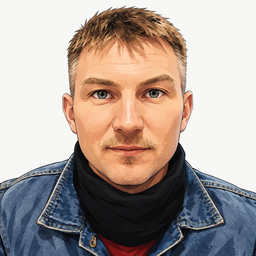

# Artem Kustikov

### Principal Consultant, KI/DevOps/FullStack Softwareentwickler

<a href="https://www.linkedin.com/in/artem-kustikov-2635917/">LinkedIn</a>
| <a href="https://github.com/artiz/">GitHub</a>
| <a href="https://www.credly.com/users/artem-kustikov/badges">Credly</a>
| <a href="https://docs.microsoft.com/en-us/users/artemkustikov-7649/">Microsoft Learning</a>

| <a href="Artem_Kustikov_CV_DE.pdf">PDF</a>
| <a href="index.html">English Version</a>

 
<a href="https://www.gulp.de/gulp2/g/spezialisten/profil/artiz">Randstad</a>
| <a href="https://www.freelancermap.at/profil/principal-consultant-ki-devops-fullstack-softwareentwickler">freelancermap.at</a>
 
Wien ¤ Österreich  
<a href="mailto:artem.kustikov@gmail.com">artem.kustikov@gmail.com</a> ¤ <a href="tel:+4366493106218">+43 664 9310 6218</a>

Principal Consultant und praxisorientierter Softwarearchitekt mit über 15 Jahren Erfahrung in der Konzeption und durchgängigen Umsetzung skalierbarer, cloud-nativer Systeme. Ich verantworte Architektur und Engineering für **KI/LLM-gestützte Anwendungen**, **verteilte ereignisgesteuerte Plattformen** und **Full-Stack-Webprodukte** und übersetze Geschäftsziele in widerstandsfähige, gut steuerbare Lösungen. Schwerpunkte: Azure-native KI- und Agentenarchitektur (Azure AI Foundry, LLM-Agenten, RAG und Wissenszugriff, Human-in-the-Loop-Workflows, Evaluation und Observability, MCP), Enterprise-Solution- und Microservices-Architektur, Infrastructure as Code und Platform Engineering (Terraform, Kubernetes, CI/CD, Managed Identity und RBAC), Cloud-Infrastruktur (Azure, AWS, GCP) sowie Echtzeit-Datenströme (Kafka, Flink). Ich verbinde technische Führung mit umfassender Liefererfahrung — Mentoring von Teams, Etablierung von Engineering-Best-Practices und die Bereitstellung skalierbarer Produktionssysteme.

### Open-Source-Projekte
- **[docling.rs](https://github.com/docling-project/docling.rs)** — Performante Rust-Neuimplementierung von Python Docling, aufgenommen in das offizielle Docling-Projekt, die über 30 Dokumentformate (PDF, DOCX, PPTX, XLSX, HTML, EPUB, Bilder, Audio) in eine einheitliche `DoclingDocument`-Struktur für KI/RAG-Pipelines umwandelt. Reiner Rust-PDF-Parser mit ONNX-Layout/TableFormer/OCR-Stack sowie Node.js/TypeScript-Bindings und LangChain-Integration.
- **[KateChat](https://github.com/artiz/kate-chat)** — Selbst-gehostete Multi-Provider-LLM-Chat-Plattform (offene ChatGPT-Alternative). React/TypeScript-Frontend mit Node.js- und Rust-Backend; integriert AWS Bedrock, OpenAI und Yandex AI mit RAG (Docling), MCP, In-Browser-Python (Pyodide) und Bildgenerierung. GraphQL-API, WebSocket-Subscriptions, PostgreSQL/Redis.

### [Erfahrung](FullExperience.md)

08.2022 - Heute <strong>Principal Consultant, KI/DevOps/FullStack Softwareentwickler</strong>

<a href="https://www.reply.com/machine-learning-reply/de">Machine Learning Reply</a>  <i>Wien, Österreich</i>

*Stack*: Node.js, React, Next.js • Java, Quarkus, Flyway • Python, PydanticAI • PostgreSQL, Cosmos DB, Redis • Apache Kafka, Flink, Confluent, Databricks • Azure AI Foundry/OpenAI, AWS Bedrock, LangChain, Langfuse, RAG, MCP, A2A • Terraform, Terragrunt, Kubernetes, Helm, Argo CD, Azure DevOps • Prometheus, Grafana • AWS, Azure

**Senior Java Entwickler/DevOps** ¤ *Plattform für einheitliches Fahrzeugdaten-Streaming* ¤ 06.2024-Heute

* Entwurf und Implementierung der Quarkus-Plattformdienste — Management API für Schemata, Datenbestellungen, Pipelines und Provisionierung, Deployment Service für Kafka-Topics, ACLs und Identity Pools auf Confluent — integriert mit Schema Registry und den Legacy-Fahrzeugdatendiensten des Kunden; nachgelagert konsumiert **Databricks** die Datenströme als **Apache-Iceberg**-Tabellen.
* Verantwortung für die Flink-Schicht: Pipeline-Persistenz auf reaktivem Hibernate/Flyway mit Auto-Restart fehlgeschlagener Jobs, byteidentisches Refactoring des zentralen Jobs, Redis-gestützter Regel-Cache und Tooling für massenhafte Migration/Aktualisierung von Flink-Pipelines; Auslieferung mit **Argo CD/Helm/Cilium**, Monitoring mit **Prometheus und Grafana**.
* Härtung und Skalierung der Azure-Edge: mTLS für Konsumenten, In-App-JWT-Validierung hinter einem Off/Shadow/Enforce-Schalter, **Managed Identity statt SPN-Credentials** sowie API-Management-JWT-Richtlinien; **Terraform/Terragrunt** für fünf Umgebungen inkl. Key Vaults und tfstate-**RBAC** über GitHub Actions mit Federated Credentials; aktuell Einführung von **Policy as Code** mit **Kyverno** für die Telemetrie-Plattform.

**Solution Architect/AI Engineer** ¤ *Self-Service-Plattform für agentische KI* ¤ 01.2026-09.2026

* End-to-End-Verantwortung für eine Self-Service-Plattform: Fachanwender beschreiben einen KI-Agenten im Chat, erhalten ihn als bearbeitbaren visuellen Workflow, veröffentlichen ihn und betreiben ihn mit echtem Traffic über gemeinsames Postfach, einbettbare Webformulare, Live-Telefonate (WebRTC) und Cron-Zeitpläne; Agenten und Modell-Deployments laufen auf **Azure AI Foundry**, Antworten stützen sich auf dessen **Vector Stores** (Upload, Ingestion, Retrieval zur Laufzeit — RAG-Wissensschicht), erfolgen in der Sprache des Kunden, gehen an Salesforce und SAP; Kundensysteme werden über OAuth2-gesicherte **MCP**-Server erreicht (Tokens AES-256-GCM-verschlüsselt, Key-Vault-Schlüssel).
* Entwurf der Architektur: ein Next.js-Portal, Azure Function Apps (Dispatcher und Executor auf **PydanticAI** über die Azure OpenAI Responses API) und Storage Queues als einzige Schnittstellen zwischen Portal, Generierungs-Bot und Laufzeit — gestreamte Ausgabe, Retry-Klassifizierung und Redis-gestütztes **Human-in-the-Loop**-Pause/Resume.
* Mandantenfähigkeit von Grund auf (domainbasierte Mandantenauflösung, Mandanten-Prädikat in jeder Abfrage, Build-brechender Test); Auslieferung als gemeinsames Portal mit kundenspezifischem Branding oder als Single-Tenant-Installation beim Kunden, aufgebaut mit **Terraform** für jede Azure-Ressource und **GitHub Actions mit OIDC-Federated-Credentials** — Bootstrap-Workflow für das State-Backend, Entra-ID-App-Registrierungen und Key Vault; das Kunden-Onboarding ist ein GitHub Environment plus tfvars-Datei.

**Solution Architect/FullStack** ¤ *Plattform für Einteilung, Abrechnung und Verträge von Konzertveranstaltern* ¤ 06.2026-09.2026

* Mandantenfähige Plattform für mehrere rechtlich getrennte Gesellschaften und Veranstaltungsformate: Ein Login trägt mehrere Rollen mit rollenspezifischen Funktionen; jede Abfrage ist über Zugriffsrechte je Mandant (**RBAC**) eingegrenzt, koppelbar an einen unterzeichneten Vertrag.
* Durchgängig **TypeScript** auf **Bun** — **GraphQL**, **Prisma/PostgreSQL**, **React/Redux**, **Google-OAuth** — auf **AWS ECS Fargate** mit **Terraform/Terragrunt** und **GitHub Actions**; vollständig mit **Claude Code** entwickelt, von Anforderungen bis Infrastruktur — Fallstudie für KI-gestützte Entwicklung im Produktionsmaßstab.

**AI/ML Engineer** ¤ *LLM-as-a-Judge-Qualitätsbewertung für Chatbots* ¤ 04.2026-06.2026

* Aufbau einer LLM-as-a-Judge-Qualitätsschicht für kundenorientierte Chatbots: Jeder Gesprächsschritt wird in Langfuse erfasst und asynchron von einem AWS Bedrock LLM-Judge plus programmierten Metriken bewertet — 9 Live-Qualitätskennzahlen (Qualität, Kosten, Eskalationsrisiko); **LLM-Evaluation und Observability**, einsetzbar mit jedem Chatbot.

**Senior DevOps/FullStack** ¤ *Web-Client für KI-Chatbot-System* ¤ 01.2025-12.2025

* Robuste CI/CD-Plattform mit integrierten Unit- und e2e-Tests (Playwright) und Feature-Umgebungen.
* Nahtlose Authentifizierung und **rollenbasierte Autorisierung (RBAC)** gegen AWS Cognito.
* Pluggable KI-Modell-Unterstützung (AWS Bedrock, OpenAI) mit **RAG**, Bildverarbeitung und Code-Interpretation; kollaborative Chats, Arbeitsbereiche und Dokumente auf Basis von WebSockets und WebRTC.

**DevOps Engineer/Senior Entwickler** ¤ *Online Sales Forecasting Tool* ¤ 01.2024-06.2024

* Refactoring bestehender Microservices in Java (Spring Boot), Python (FastAPI) und R (plumber) zur Skalierung in k8s; CI/CD-Framework mit GitHub Actions. Migration der Legacy-Infrastruktur von AWS (RDS, EC2, CloudFormation) auf einen privaten OpenShift-Cluster mit Deployment über Helm-Charts, Tekton-Trigger und -Pipelines.

**Senior FullStack Developer/DevOps Engineer** ¤ *Backend/Infrastruktur für kassenlosen Store* ¤ 08.2022-12.2023

* Integration eines externen In-Store-Computer-Vision-Systems in die Einkaufsreise sowie der Zahlungsanbieter Fiserv, Adyen und PayPal; eigene Whitelist-Lösung zum Sperren nicht unterstützter Zahlungsmethoden.
* Deployment der Backend-Microservices (AKS, Terraform, Helm), Performance-Arbeit, Elasticsearch-Integration und Vor-Ort-Analytics; Refactoring inkl. verteilter DB-Migrationen als k8s-Jobs mit Init-Containern gegen Konflikte bei parallelen Deployments.

---

05.2018 - 02.2022 <strong>Systemarchitekt/Senior FullStack Softwareentwickler</strong>

<a href="https://intetics.com/">Intetics</a>  <i>Minsk, Belarus</i>

*Stack*: Node.js (express, restify), ReactJS (TypeScript, redux, lerna, grpc-web), Go lang (GRPC, protobuf), Threedium, Rust, Docker, Kubernetes, Google Cloud Platform, MongoDB, PostgreSQL, Bigtable

Arbeit an großem B2B-Projekt in der Modebranche (#1 auf dem US-Markt), Integrationsaufgaben und Entwicklung einer benutzerdefinierten ETL-Engine (Extract, Transform, Load).

* Profiling und Refactoring von Node.js-Microservices; interaktive UI für das ETL-Tool mit [React Flow](https://reactflow.dev/), [dagre](https://www.findbestopensource.com/product/dagrejs-dagre) und GRPC.
* Design und Implementierung von [Box.com](https://www.box.com/)- und [Dropbox](https://www.dropbox.com/)-Konnektoren für die ETL-Engine (Go lang); Integration von excelize in den XSL-Prozessor samt mehrerer [Fixes](https://github.com/qax-os/excelize/pulls?q=is%3Apr+is%3Amerged+artiz).
* Integration von [Threedium](https://threedium.co.uk/) 3D-Modellen mit einer benutzerdefinierten React-Komponente.

---

10.2008 - 05.2018 <strong>Systemarchitekt/Senior Softwareentwickler</strong>

<a href="https://www.effectivesoft.com/">EffectiveSoft</a>  <i>Minsk, Belarus</i>

Teilnahme an 20+ Projekten, darunter NLP- und Textmining-Tool Intellexer.

*Stack*: Node.js (express), React, Angular, Ext.js, AWS (EC2, ElasticBeanstalk, RDS, CloudFront), MySQL, Redis, MongoDB, .NET (C#/Managed C++), ASP.NET MVC, C++, COM, WinAPI, ActiveMQ, Python.

* **Crowdfunding-Software** — B2B-Plattform für lokale Unternehmen mit Integration des [Dwolla](https://www.dwolla.com/) Zahlungssystems: Architektur von Web-Client und Admin-App, CI (Bitbucket Pipelines, AWS CloudFormation) und ein Node.js-Worker für Geldtransfers, Zinsberechnung und Finanzprüfung.
* **Medizin: DICOM/ECG-Parsing und -Analyse** — universeller ECG-Datenlader anstelle duplizierter Formatimplementierungen (Physionet, EFS, ISHNE, HL7), Canvas-basierter Web-Client für DICOM-Bilder (Zoom, WL-Transformation, Messung) und ein Tool zur Klinik-Personalsynchronisation mit ASP.NET MVC/SignalR.

---

10.2006 - 10.2008 <strong>Senior Softwareentwickler</strong>

InventionMachine/<a href="https://ihsmarkit.com/">IHS Markit</a>  <i>Minsk, Belarus</i>

*Stack*: .NET, C#, C++, ATL/MFC, JavaScript/AJAX, Java, ColdFusion

---

06.2004 - 09.2006 <strong>Softwareentwickler</strong>

<a href="https://scand.com/">SCAND</a>  <i>Minsk, Belarus</i>

*Stack*: ASP 3.0 (VBScript), JavaScript/AJAX, C#, C++/boost/pthread, Java/Spring, MS SQL Server, Oracle

---

12.2002 - 06.2004 <strong>Postgraduierter Student, Lehrer</strong>

Belarusian National Technical University  <i>Minsk, Belarus</i>

Rechnergestütztes Modellierungssystem zur Simulation realer Industrieroboter und ihrer Umgebung: Roboterkinematik, Kollisionsdetektion und analytische Programmierung. Dozent an der BNTU (Grundlagen der Computernetzwerke, Mathematische Grundlagen der Roboterprogrammierung).

### Fähigkeiten
- **JavaScript Full Stack**: (2002-heute) TypeScript, React/redux, Angular, Node.js, Express, Next.js, REST/GraphQL
- **DevOps**: (2015-heute) Docker, Terraform, Kubernetes, AWS, Azure, GCP, Gitlab
- **Python**: (2008-heute) Django, Flask, FastAPI, SQLAlchemy, Celery, NumPy, Pandas, Pytorch, scikit-learn
- **Java**: (2004-heute) Java 1.3/21, JBoss, Tomcat, Spring Framework, Spring Boot, Quarkus, Gradle
- Durchführung von 500+ technischen Interviews in JavaScript, DevOps, Java, .NET und Golang

### Ausbildung  
Belarusian National Technical University | Minsk, Belarus  *1997-2002* | Informatik, Robotik

### Zertifikate
* 06.2026: [Microsoft AI & ML Engineering](https://www.coursera.org/account/accomplishments/specialization/IJO7N1ZRIVU1)
* 01.2026: [AWS Generative AI Applications](https://coursera.org/share/23b43449064c4afbf75a5720870662bd)
* 10.2025: [Confluent Certified Developer for Apache Kafka](https://certificates.confluent.io/edc46443-cd6d-4df4-b16b-cf93cbb12127)
* 05.2024: HashiCorp Certified: [Terraform Associate (003)](https://www.credly.com/badges/557b7fc7-3b7d-4e0e-a3e9-3b2ae33e5ba2)
* 10.2023: [AWS Certified Solutions Architect – Associate](https://www.credly.com/badges/53834e5c-40db-46d0-a6b9-87f5f9e7f628)
* 08.2022: [DevOps on AWS](https://coursera.org/share/245636d69ad3646f868b10d707509883)
* 04.2017: [Machine Learning and Data Analysis from MIPT/Yandex](https://coursera.org/share/c643a772fe5ce8a01738afd8aff29a93)
* 09.2016: [MCSA: Web Applications](https://www.credly.com/badges/0daf0adb-71dc-4fc3-8c5a-203c3e0c0fdc) ([Zertifikat](assets/MCSA_Web_Applications.pdf))
* 02.2013: Microsoft Certified Solutions Developer: Web Applications

### Sprachen

Russisch (Muttersprache) • Englisch (verhandlungssicher), IELTS 6.5, CEFR B2 • Deutsch (beruflich), OIF Integrationsprüfung B1
